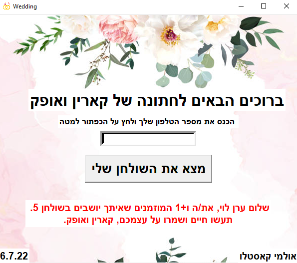

# SeatMe
<br>

## Project Overview
At every wedding in Israel (or perhaps around the world), there's always an issue with seating guests at the right table. Heaven forbid that Aunt Miriam sits with Aunt Rachel since their argument at last Passover. There's also the desire of hosts not to open additional tables unnecessarily to avoid unnecessary expenses. And let's be honest, if you're not paying an external company, it'll probably require some family diplomacy to assign everyone their table.

So, my sister is getting married this summer, and she was a bit concerned about this (we had an unpleasant experience with it at my brother's wedding). So, I had some free time and decided to try to help her by building a small project over a couple of days, and here's what came out:

  

As you can see, everything is customizable, of course (those who understand a thing or two about Python shouldn't struggle too much).

I wanted the guest to deal only with the keyboard, so all they need to do is simply enter their phone number and then press either ENTER or the button, and the software outputs a nice and personal message with their table number, which disappears automatically after 10 seconds, like this:

 

### We know the phone number because the hosts will need to do some small work beforehand, which is to create an Excel file with the following columns:
* First Name
* Last Name
* Number of Invited Guests
* How Many Confirmed Attendance
* Table Number
* Phone Number

<br>
<hr>

## Requirements

Install the dependencies with pip

```
tkinter
xlrd
```

### Note:

In order to make changes to the software according to your specific needs, it's essential to have a basic understanding of Python programming.
Additionally, please ensure you have an .xls file with the required columns mentioned in the project overview section, as the software relies on this input data.

